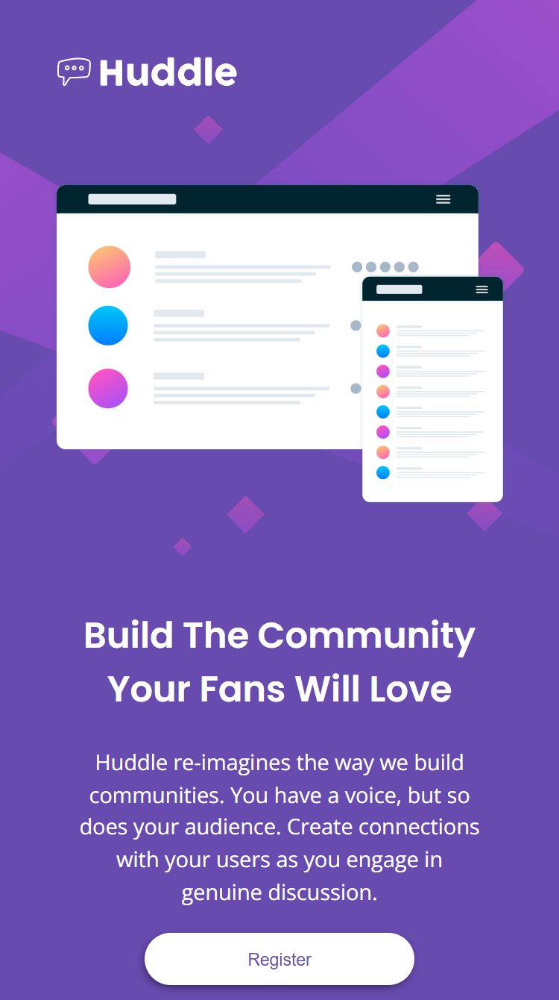
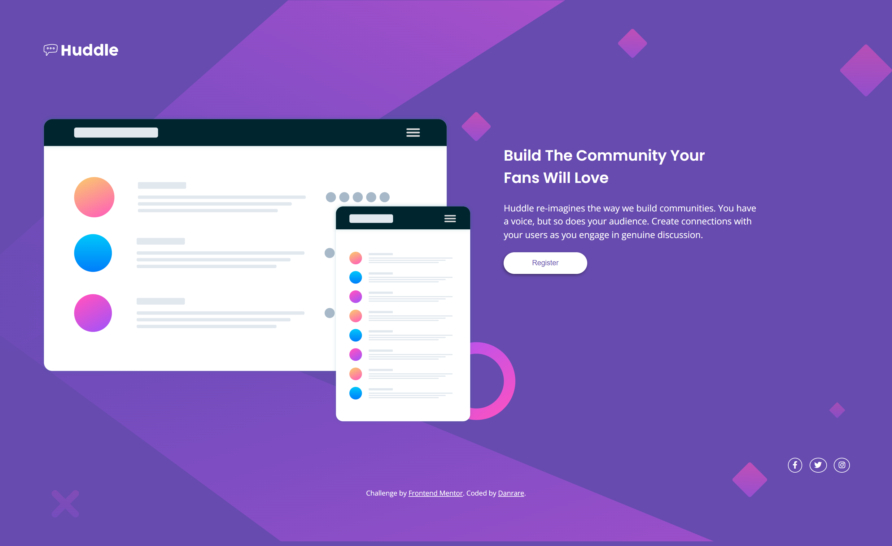

# Frontend Mentor - Huddle landing page with single introductory section solution

This is a solution to the [Huddle landing page with single introductory section challenge on Frontend Mentor](https://www.frontendmentor.io/challenges/huddle-landing-page-with-a-single-introductory-section-B_2Wvxgi0). Frontend Mentor challenges help you improve your coding skills by building realistic projects. 

## Table of contents

- [Overview](#overview)
  - [The challenge](#the-challenge)
  - [Screenshot](#screenshot)
  - [Links](#links)
- [My process](#my-process)
  - [Built with](#built-with)
  - [What I learned](#what-i-learned)
  - [Continued development](#continued-development)
  - [Useful resources](#useful-resources)
- [Author](#author)


## Overview
This a challenge from frontend mentor to build a huddle landing page.

### The challenge

Users should be able to:

- View the optimal layout for the page depending on their device's screen size
- See hover states for all interactive elements on the page

### Screenshot




### Links

- Solution URL: [Add solution URL here](https://github.com/danrare/huddle-landing-page)
- Live Site URL: [View livepage](https://danrare.github.io/huddle-landing-page/)

## My process

### Built with

- CSS custom properties
- Flexbox
- Mobile-first workflow
- responsive layouts
- sass
- relative and static units 

### What I learned

The challenge was a bit challenging especially when I had to determie hoe it should layed-out on medium screens. I learnt quite a lot inthe challenge. Some of these are; Working with fontawesome cdn from cdnjs. This was an issue because fontawesome discontinued their cdn feature and instead created an alternative, a kind of kit. Also, I reinforced my knowledge on flexbox and media queries. I made use of flexbox:wrap for the first time in a layout. I did this for the medium screen. Lastly, I reinforced the knowledge on building websites by making your own judgemental calls, just eye reading. Building website based on judgement calls is a create way to learn new things. That's it my journey through the huddle-landing-page.    

To see how you can add code snippets, see below:


```css
.proud-of-this-css {
  flex-wrap: wrap;
  --bg-color: hsl(257, 40%, 49%);
  --secondary-color: hsl(300, 69%, 71%);
  --header-font: "Poppins", sans-serif;
  --body-font: "Open sans", sans-serif;
}

```

### Continued development

I will love to learn how to use fontawesome kit feature in my future projects since I am not yet accustomed to working with it. Further more, I will learn to improve on my use of sass because I olny used it to converge all my styles sheet to one. Lastly, I will look into the less features.

### Useful resources

- [Example resource 1](https://cdnjs.com/) - This helped me in using fontawesome6 cdn. It more easier to work with than using fontawesome6 kit.
- [Example resource 2](https://www.oreilly.com/library/view/css-in-depth/9781617293450/) - This is an amazing book which helped me finally understand how to work with relative units and css reset. I'd recommend it to anyone still learning this concept.

## Author
- Frontend Mentor - [@danrare](https://www.frontendmentor.io/profile/danrare)
- Twitter - [@Danrare1](https://www.twitter.com/Dan Rare)
